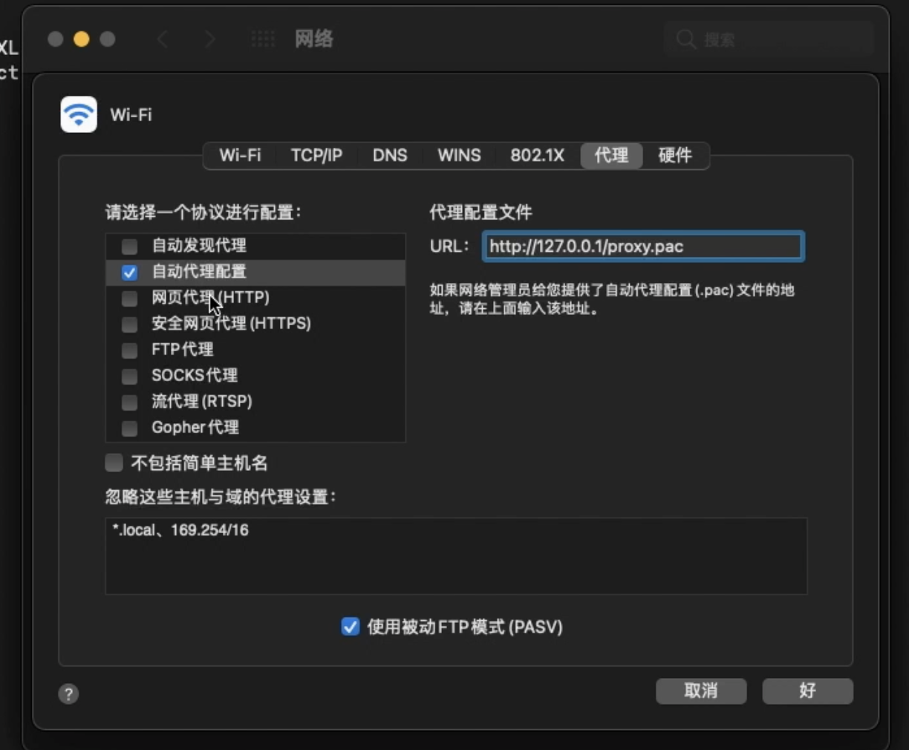
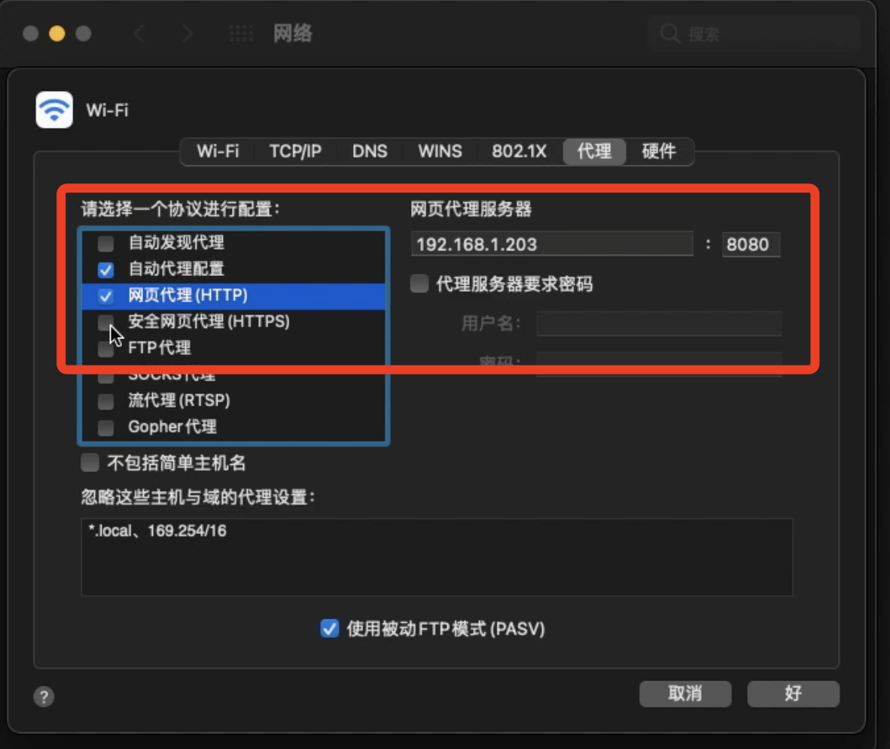
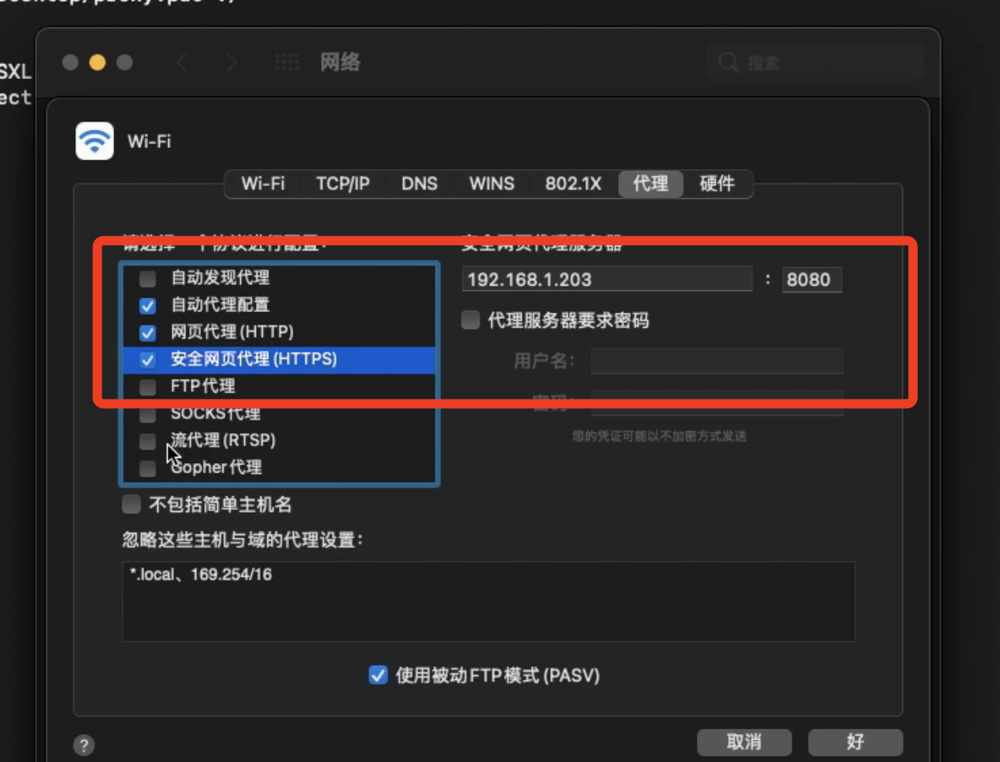
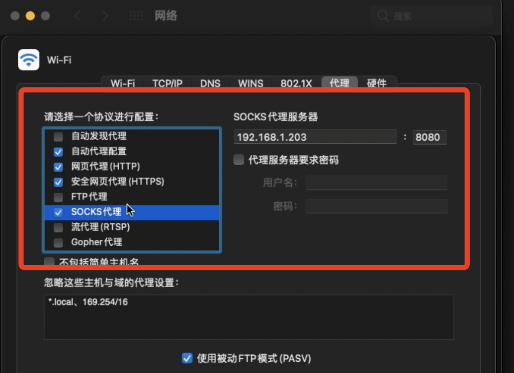

### 1、下载 proxy.pac 文件， 并拷贝到 mac apache2 服务器下。

```bash
#下载 proxy.pac 文件， 并拷贝到 mac apache2 服务器下。
$ sudo cp proxy.pac  /Library/WebServer/Documents/  

```

### 2、启动 apache2服务器

```bash
# 启动 apache2
$ sudo apachectl start 
```

### 3、在网络中配置代理内容

**HTTPS和HTTP以及SOCKET代理都需要在本地有一个代理服务器存在。**











