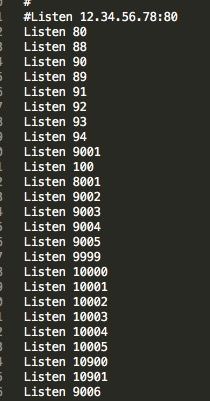
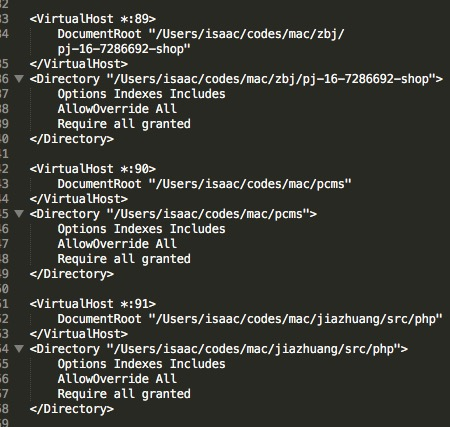

# apache2

## 开启并配置成文件服务器

```text
配置文件地址:  /etc/apache2  
    第一配置文件:  httpd.conf 
    第二配置文件:  /extra/httpd-vhosts.conf //这个基本不用动
    
    
修改配置文件可以达到外网通过http来访问和下载本地文件
httpd.conf : 修改如下 . 全程 sudo


1).
<IfDefine !SERVER_APP_HAS_DEFAULT_PORTS>
    Listen 8080
    Listen 880
    Listen 881                               
</IfDefine>
# 通过这样修改使得开启多个端口,只有开启端口才能建立多个访问位置

2).
#LoadModule php7_module libexec/apache2/libphp7.so
# 寻找 php 达到了这行,将 # 删除, 如果内容不同那么就按照找到的来进行删除.

3).
# 想要分享多个文件时,按照下面的多次复制和修改
# 上面也必须添加端口号
<VirtualHost *:881>              
# 端口号

	DocumentRoot "/Volumes"  
# 文档根,相当于分享的目录

</VirtualHost>
<Directory "/Volumes">           
# 跟上面保持一致,然后底下完全照抄

	Options Indexes FollowSymLinks Multiviews
	MultiviewsMatch Any
	AllowOverride All
	Require all granted
</Directory>
# 文件自带的也修改成这样,不要放过.


4).
# 查找Options ，在Options和Follow之间增加一个单词 Indexes 
  这样的一行  Options FollowSymLinks Multiviews
5).
# 刷新apache服务: sudo apachectl -k restart 
# 用浏览器访问端口: 1234.tpddns.cn:881


共享硬盘设置 (实际分享完成后在局域网内就可以直接使用设备访问,而不需要在外网绕个大圈回来)
     
ipad端 实现文件夹查看  
     
win端 可以使用WinSCP 来实现访问和文件操作等
     
mac端 使用访达就可以实现


    //开启apache:  sudo /usr/sbin/apachectl start
     
    //重启apache:  sudo /usr/sbin/apachectl restart
    
    //关闭apache:  sudo /usr/sbin/apachectl stop

    //查询httpd的pid: sudo ps -ef | grep httpd
 
    //强制杀死一个进程: sudo killall httpd
    //刷新apache:  sudo /usr/sbin/apachectl -k restart
```





## 可能会出现的问题的   解决方法

* 因为mac是UTF8编码,所以在使用的时候可能会出现乱码,那么修改一下手机端应用的编码就可以了,浏览器的话也可以修改显示编码的.
* apche2 网页端实现文件查看
  * 

