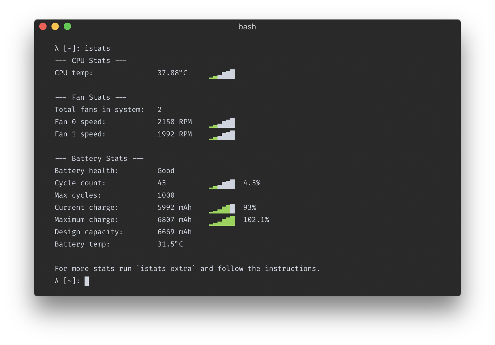

# istats  温度命令\(无需 App，即时了解 Mac 温度\)

## 无需 App，即时了解 Mac 温度

MacBook Pro 的散热，见仁见智。但面板烫手时，还是想看看 CPU、电池的具体温度的，一是好奇，二是持续高温有损电池寿命。

说无需 App，其实还是用到一个 Ruby gem 的，叫做 [iStats](https://chris911.github.io/iStats/)。注意，跟收费 App – iStat Menus 是不一样的。

安装简单（系统自带 Ruby 可能需要 sudo）

```text
gem install iStats
```

使用简单，终端直接运行 `istats` 即可。



终端不常驻的话，还可以写一个简单的 Alfred Workflow，通过 Alfred 即时查看。


新建一个无需参数的 Workflow（Script Filter），语言为 Bash，脚本如下。这里只是 grep 出了 CPU 和电池两项，拆分输出成两行（如上图）。

```text
temp=`/YOUR_PATH/istats | grep -E '(CPU|Battery)\ temp'`
cpu=$(echo $temp | cut -f1 -d\°)"°C"
bat="B"$(echo $temp | cut -f2 -d\B)

cat << EOB
{"items": [
    {"title": "$cpu"},
	{"title": "$bat"}
]}
EOB
```

注意：请先在终端运行一下 `which istats` 获得实际路径，替换上边的 YOUR\_PATH。另外，也可以单独获得每个设备的温度信息，比如这样：

```text
cpu="CPU: "`/xxxx/istats cpu temp --no-graphs | tr -s ' ' | cut -d ' ' -f3`
bat="BAT: "`/xxxx/istats battery temp --no-graphs | tr -s ' ' | cut -d ' ' -f3`
fan=`/xxxx/istats fan speed --no-graphs`
fan0="Fan 0: "$(echo $fan | head -1 | tr -s ' ' | cut -d ' ' -f4)" RPM"
fan1="Fan 1: "$(echo $fan | tail -1 | tr -s ' ' | cut -d ' ' -f4)" RPM"
```

