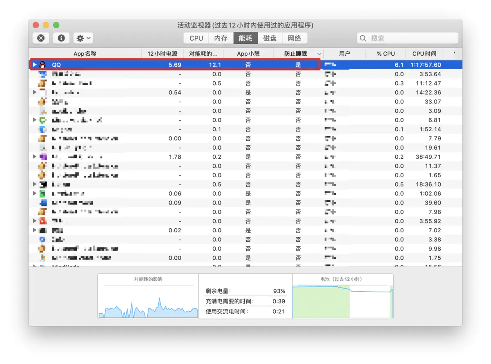

## 查看哪个软件阻止了锁屏后熄屏命令

```bash
$ sudo pmset -g
System-wide power settings:
Currently in use:
 standby              1
 Sleep On Power Button 1
 hibernatefile        /var/vm/sleepimage
 powernap             1
 networkoversleep     0
 disksleep            10
 sleep                45 (sleep prevented by coreaudiod, powerd, sharingd, bluetoothd)
 hibernatemode        3
 ttyskeepawake        1
 displaysleep         30 (display sleep prevented by BaiduNetdisk_mac)	# 这里是百度网盘阻止了熄屏
 tcpkeepalive         1
 lowpowermode         0
 womp                 1
```

可能下载了某些软件会在mac合上盖子还会唤醒mac从而阻止休眠，这时候打开活动监视器然后点能耗查看，把防止睡眠中如果有程序是“是”就改成“否”。我没想到的是QQ卡死没响应还会导致电脑无法进入睡眠，直接把QQ给关掉了，反正手机上还有


