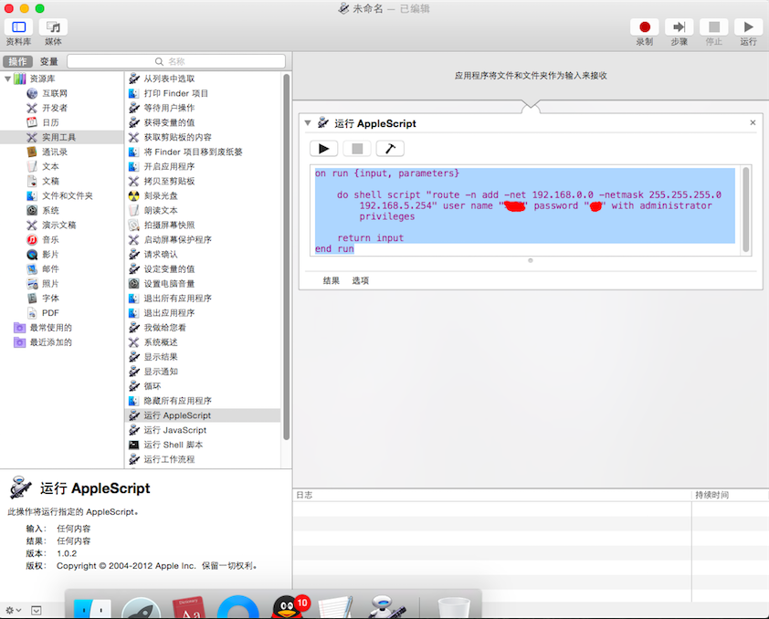

### DNS配置

```ini
223.5.5.5
119.29.29.29
8.8.8.8
8.8.4.4
114.114.114.114
1.1.1.1
```


### IP地址配置

```ini
IP:    50.7.21.232
掩码:   255.255.255.0
路由器: 50.7.21.254
```


### mac自动操作路由配置代码进行双网卡切换

```bash
#  点击Automator  , 选取应用程序  ,在左边 资源库 中选取 实用工具—>运行AppleScript 
# 运行 appleScript 内容

on run {input, parameters}
	#设置IP路由 
	#删除路由配置原本内容, 16.16.20.0是需要访问的IP ，从配置IP为 50.7.21.254 走, 接口为 en12。 
	do shell script "sudo route -v delete -net 16.16.20.0 -gateway 50.7.21.254" user name "用户" password "密码" with administrator privileges
	do shell script "sudo route -v delete -net 16.16.20.1 -gateway 50.7.21.254" user name "用户" password "密码" with administrator privileges
	#删除路由
	# do shell script "sudo route -v delete -net 192.168.230.0 -gateway 192.168.230.255 2>/dev/null" user name "用户" password "密码" with administrator privileges
	
	#添加路由_ 原本内容
	do shell script "sudo route -n add -net 16.16.20.0/24 50.7.21.254 " user name "用户" password "密码" with administrator privileges
	
	do shell script "sudo route  -n add -net 16.16.20.1  -netmask 255.255.255.0  50.7.21.254 " user name "用户" password "密码" with administrator privileges
	
	do shell script "sudo route  -n  add -net 16.16.20.0  -netmask 255.255.255.0  -interface en12" user name "用户" password "密码" with administrator privileges
	
	
	return input
end run
```


## MAC添加路由

```bash
mac route命令同时访问内外网 
sudo route -n add -net 192.168.0.0 -netmask 255.255.255.0 192.168.5.254 
sudo route -n add -net 192.168.3.0 -netmask 255.255.255.0 192.168.5.254 
sudo route -n add -net 192.168.2.0 -netmask 255.255.255.0 192.168.5.254

Windows route命令同时访问内外网 
route add -p 192.168.3.0 mask 255.255.255.0 192.168.5.254 
route add -p 192.168.0.0 mask 255.255.255.0 192.168.5.254 
route add -p 192.168.2.0 mask 255.255.255.0 192.168.5.254

```


