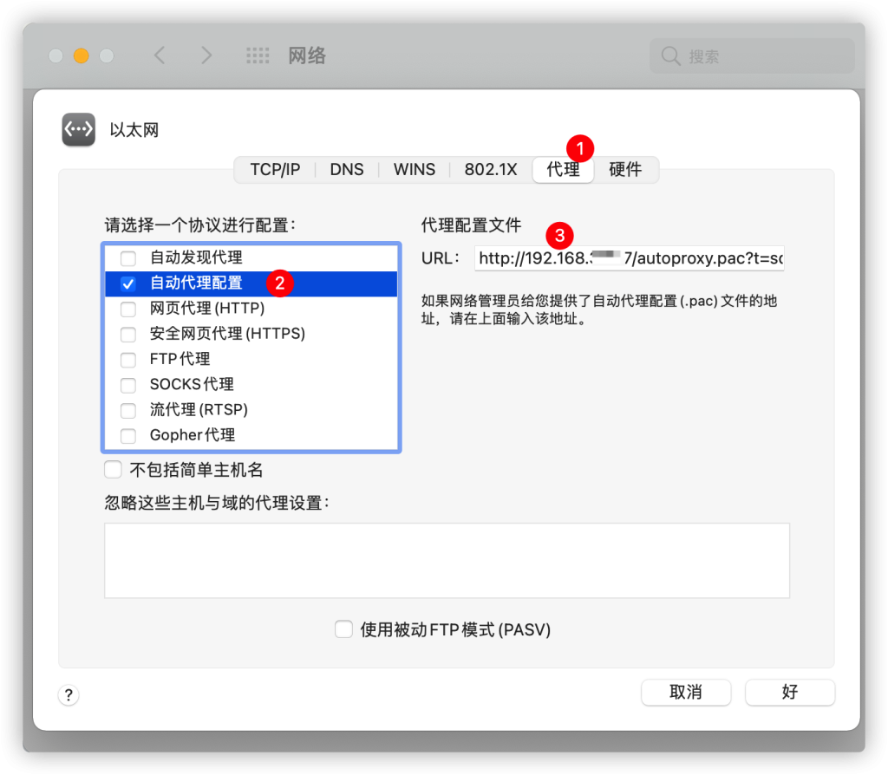
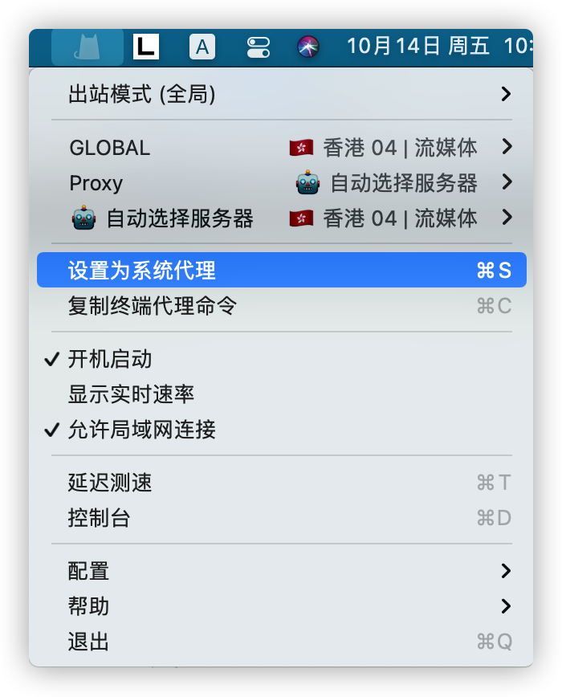
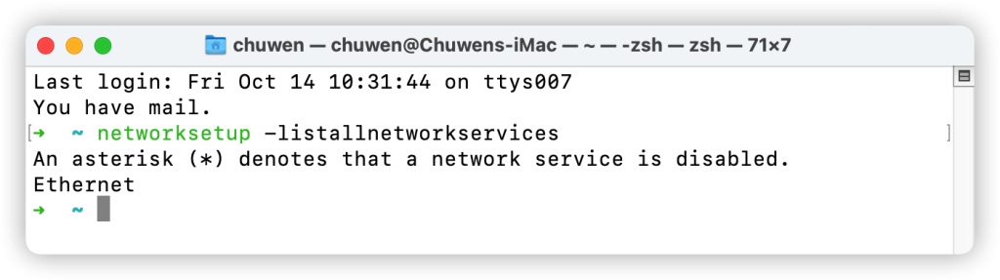
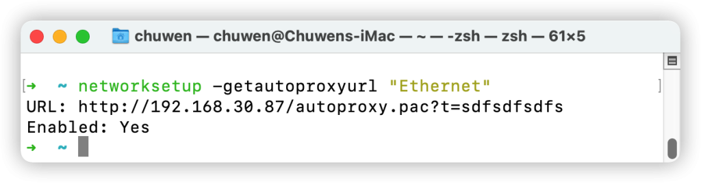

## networksetup


### 如何关闭Wi-Fi

```bash
networksetup -setairportpower en0 off1
```

### 如何启动Wi-Fi

```bash
networksetup -setairportpower en0 on1
```


| 旗标                                                         | 描述                                                         |
| :----------------------------------------------------------- | :----------------------------------------------------------- |
| `-listallnetworkservices`                                    | 显示电脑的硬件端口上所有网络服务的列表。星号 (*) 表示已停用网络服务。 |
| `-setmanual networkservice``    ip subnet router`            | 将网络服务的 TCP/IP 配置设定为手动，其中将 IP 地址设定为 `ip`，子网掩码设定为 `subnet`，而路由器地址设定为 `router`。示例：`networksetup -setmanual "Ethernet" 192.168.100.100 255.255.255.0 192.168.100.1` |
| `-setdhcp networkservice``    [clientid]`                    | 将指定网络服务的 TCP/IP 配置设定为使用 DHCP。客户端 ID 可选。将“Empty”指定给 [clientid] 将清除 DHCP 客户端 ID。示例：`networksetup -setdhcp "Ethernet"` |
| `-setbootp networkservice`                                   | 将指定网络服务的 TCP/IP 配置设定为使用 BOOTP。示例：`networksetup -setbootp "Ethernet"` |
| `-setmanualwithdhcprouter networkservice ip`                 | 指定要用于指定网络服务的 DHCP 的手动 IP 地址。示例：`networksetup -setmanualwithdhcprouter "Ethernet" 192.168.100.120` |
| `-setdnsservers networkservice dns1 [dns2]`                  | 指定你想要指定网络服务用于解析域名的服务器 IP 地址。你可以列出任意服务器数量（将 `dns1`、`dns2` 等替换为域名服务器的 IP 地址）。如果你想要清除指定网络服务的所有 DNS 条目，请键入“empty”代替 DNS 服务器名称。示例：`networksetup -setdnsservers "Ethernet" 192.168.100.100 192.168.100.12` |
| `-setsearchdomains networkservice domain1 [domain2]`         | 指定特定网络服务的搜索域。你可以列出任意搜索域数量（将 `domain1`、`domain2` 等替换为本地域的名称）。如果你想要清除指定网络服务的所有搜索域条目，请键入“empty”代替域名。示例：`networksetup -setsearchdomains "Ethernet" example.com foo.com` |
| `-setwebproxy networkservice``    domain portnumber (on | off) [username password]` | 使用域和端口号设定网络服务的网页代理。关闭代理。选择性地指定 `on` 或 `off` 以启用和停用已认证的代理支持。如果打开已认证的代理支持，请指定用户名称和密码。示例：`networksetup -setwebproxy "Ethernet" proxy.company.com 80 on steve mypassword` |
| `-help`                                                      | 显示“网络设置工具”中所有可用命令的列表，其中包含说明性信息。 |


# macOS 使用 networksetup 命令设置 PAC 代理

因为手动在网络设置里，设置的 PAC可能会因为其它软件给关掉，如 ClashX 设置为系统代理替换掉。然后自己手动替换又比较麻烦，所以想着用命令去替换一下。





## 解决方案

在网上找到了一篇问答 https://apple.stackexchange.com/a/166443，里面讲到使用 `networksetup -setautoproxyurl` 命令即可。

### networksetup -setautoproxyurl 语法如下

```
networksetup -setautoproxyurl <network services> <pac address>
```

#### 问题：怎么拿到 `<network services>` ？

可以通过 `networksetup -listallnetworkservices` 命令拿到（只是猜测，因为我的是黑苹果，并且是有以太网网卡）



#### 示例

拿到 newwork services

```bash
networksetup -listallnetworkservices

# 输出：
Wi-Fi
iPhone USB
Ethernet
```

给以太网网卡和WiFi设置 PAC 地址

```bash
networksetup -setautoproxyurl "Ethernet" "http://192.168.30.87/autoproxy.pac"
networksetup -setautoproxyurl "Wi-Fi" "http://192.168.30.87/autoproxy.pac"
```

然后检查下设置状态 ：

```bash
networksetup -getautoproxyurl "Ethernet"
networksetup -getautoproxyurl "Wi-Fi"
```




命令手册：


```ruby
$ man networksetup
```

可以知道 networksetup 命令地址是：/usr/sbin/networksetup


```bash
The networksetup command is used to configure network settings typically configured in

    the System Preferences application.  The networksetup command requires at least "admin"

    privileges to run. Most of the set commands require "root" privileges to run.

    Any flag that takes a password will accept "-" in place of the password to indicate it

    should read the password from stdin.
```

networksetup 命令是用来配置 系统偏好设置中的 网络设置，networksetup 需要至少 admin 权限来运行。部分命令需要 root 权限。

方法及使用

networkservice


```json
[-listnetworkserviceorder]

[-listallnetworkservices]

[-getinfo networkservice]
```

1
使用示例：


```ruby
$ networksetup -getinfo "Wi-Fi"

DHCP Configuration

IP address: 10.2.5.1

Subnet mask: 255.255.0.0

Router: 10.24.0.1

Client ID:

IPv6: Automatic

IPv6 IP address: none

IPv6 Router: none

Wi-Fi ID: 88:88:98:cc:22:00
```

2


```csharp
$ networksetup -listnetworkserviceorder

An asterisk (*) denotes that a network service is disabled.

(1) iPad USB

(Hardware Port: iPad USB, Device: en5)

(2) iPhone USB

(Hardware Port: iPhone USB, Device: en4)

(3) Wi-Fi

(Hardware Port: Wi-Fi, Device: en0)

(4) Bluetooth PAN

(Hardware Port: Bluetooth PAN, Device: en3)

(5) Thunderbolt Bridge

(Hardware Port: Thunderbolt Bridge, Device: bridge0)
```

3


```csharp
$ networksetup -listallnetworkservices

An asterisk (*) denotes that a network service is disabled.

iPad USB

iPhone USB

Wi-Fi

Bluetooth PAN

Thunderbolt Bridge
```

hardwareports


```json
[-listallhardwareports]

[-detectnewhardware]

[-getmacaddress hardwareport]
```

使用示例：


```ruby
$ networksetup -listallhardwareports

Hardware Port: Wi-Fi

Device: en0

Ethernet Address: 88:88:98:cc:22:00

Hardware Port: Bluetooth PAN

Device: en3

Ethernet Address: 88:88:98:cc:22:01

Hardware Port: Thunderbolt 1

Device: en1

Ethernet Address: 88:88:98:cc:22:02

Hardware Port: Thunderbolt 2

Device: en2

Ethernet Address: 88:88:98:cc:22:03

Hardware Port: Thunderbolt Bridge

Device: bridge0

Ethernet Address: 88:88:98:cc:22:04

VLAN Configurations

===================
```

computername


```json
[-getcomputername]

[-setcomputername computername]
```

dhcp、route、domain


```json
[-setmanual networkservice ip subnet router]

[-setdhcp networkservice [clientid]]

[-setbootp networkservice]

[-setmanualwithdhcprouter networkservice ip]

[-getadditionalroutes networkservice]

[-setadditionalroutes networkservice [dest1 mask1 gate1] [dest2 mask2 gate2] ..

. [destN maskN gateN]]
```

使用示例：


```ruby
$ networksetup -setmanual "Built-in Ethernet" 192.168.100.100 255.255.255.0 192.168.100.1
```

ipv4 & ipv6


```json
[-setv4off networkservice]

[-setv6off networkservice]

[-setv6automatic networkservice]

[-setv6linklocal networkservice]

[-setv6manual networkservice address prefixLength router]

[-getv6additionalroutes networkservice]

[-setv6additionalroutes networkservice [dest1 prefixlength1 gate1] [dest2 prefi

xlength2 gate2] ... [destN prefixlengthN gateN]]
```

dns


```json
[-getdnsservers networkservice]

[-setdnsservers networkservice dns1 [dns2] [...]]
```

使用示例：


```ruby
$ networksetup -setdnsservers "Built-in Ethernet" 192.168.100.100 192.168.100.12

$ networksetup -getdnsservers "Wi-Fi"

There aren't any DNS Servers set on Wi-Fi.

$ networksetup -getdnsservers en0

en0 is not a recognized network service.

** Error: The parameters were not valid.
```

domain


```json
[-getsearchdomains networkservice]

[-setsearchdomains networkservice domain1 [domain2] [...]]

[-create6to4service networkservicename]

[-set6to4automatic networkservice]

[-set6to4manual networkservice relayAddress]
```


```css
networksetup -setsearchdomains "Built-in Ethernet" company.com corp.com
```

代理 proxy

ftp代理


```json
[-getftpproxy networkservice]

[-setftpproxy networkservice domain portnumber authenticated username password]

[-setftpproxystate networkservice on | off]
```

网页代理


```json
[-getwebproxy networkservice]

[-setwebproxy networkservice domain portnumber authenticated username password]

[-setwebproxystate networkservice on | off]
```


```css
networksetup -setwebproxy "Built-in Ethernet" proxy.company.com 80

networksetup -setwebproxy "Built-In Ethernet" proxy.company.com 80 On authusername

    authpassword
```

安全网页代理


```json
[-getsecurewebproxy networkservice]

[-setsecurewebproxy networkservice domain portnumber authenticated username password]

[-setsecurewebproxystate networkservice on | off]
```

流代理


```json
[-getstreamingproxy networkservice]

[-setstreamingproxy networkservice domain portnumber authenticated username password]

[-setstreamingproxystate networkservice on | off]
```

gopher 代理


```json
[-getgopherproxy networkservice]

[-setgopherproxy networkservice domain portnumber authenticated username password]

[-setgopherproxystate networkservice on | off]
```


```json
[-getsocksfirewallproxy networkservice]

[-setsocksfirewallproxy networkservice domain portnumber authenticated username password]

[-setsocksfirewallproxystate networkservice on | off]
```

设置忽略这些主机与域的代理设置


```json
[-getproxybypassdomains networkservice]

[-setproxybypassdomains networkservice domain1 [domain2] [...]]
```


```json
[-getproxyautodiscovery networkservice]

[-setproxyautodiscovery networkservice on | off]
```

使用被动FTP模式


```json
[-getpassiveftp networkservice]

[-setpassiveftp networkservice on | off]
```

使用示例：

1


```ruby
$ networksetup -setwebproxy "Wi-Fi" 10.240.188.10 8080
```

2


```ruby
$ sudo networksetup -getproxybypassdomains "Wi-Fi"

$ networksetup -setproxybypassdomains "Wi-Fi"  *.local、169.254/16、10.24
```

3


```ruby
$ networksetup -getpassiveftp "Wi-Fi"

Passive FTP: Off
```

airport


```json
[-getairportnetwork device]

[-setairportnetwork device network [password]]

[-getairportpower device]

[-setairportpower device on | off]
```

使用示例：

1


```kotlin
$ networksetup -getairportnetwork en0

Current Wi-Fi Network: MS480-5G

$ networksetup -getairportnetwork en1

en1 is not a Wi-Fi interface.

** Error: Error obtaining wireless information.
```


```csharp
preferredwirelessnetworks 首选网络

[-listpreferredwirelessnetworks hardwareport]

[-addpreferredwirelessnetworkatindex hardwareport network index securitytype [password]]

[-removepreferredwirelessnetwork hardwareport network]

[-removeallpreferredwirelessnetworks hardwareport]
```

使用示例：

列出来的都是曾经连接过的Wifi名称

```dart
$ networksetup -listpreferredwirelessnetworks en0

Preferred networks on en0:
	CMCC-211
	11111115
	11111111
	MERCURY_B2-12
	CMCC-602
	TP-LINK_89B3
```

networkserviceenabled


```json
[-getnetworkserviceenabled networkservice]

[-setnetworkserviceenabled networkservice on | off]

[-createnetworkservice networkservicename hardwareport]

[-renamenetworkservice networkservice newnetworkservicename]

[-getdnsservers networkservice newnetworkservicename]

[-removenetworkservice networkservice]

[-ordernetworkservices service1 [service2] [service3] [...]]
```

使用示例：


```ruby
$ networksetup -getnetworkserviceenabled "Wi-Fi"

Enabled

$ networksetup -getnetworkserviceenabled en0

en0 is not a recognized network service.

** Error: The parameters were not valid.

$ networksetup -duplicatenetworkservice "Built-In Ethernet" "Local LAN"
```

MTU


```json
[-getMTU hardwareport]

[-setMTU hardwarePort value]

[-listvalidMTUrange hardwareport]
```

使用示例：


```ruby
$ networksetup -getMTU en0

Active MTU: 1500 (Current Setting: 1500)

$ networksetup -getMTU "Wi-Fi"

Active MTU: 1500 (Current Setting: 1500)

$ networksetup -setMTU en0 1500
```

media


```json
[-getmedia hardwareport]

[-setmedia hardwareport subtype [option1] [option2] [...]]

[-listvalidmedia hardwareport]
```

使用示例：


```ruby
$ networksetup -getmedia en0

Current: autoselect

Active: autoselect

$ networksetup -setMedia en0 autoselect

$ networksetup -setMedia en0 100baseTX half-duplex

$ networksetup -listvalidmedia en0

autoselect
```

VLAN


```json
[-createVLAN name parentdevice tag]

[-deleteVLAN name parentdevice tag] [-listVLANs]

[-listdevicesthatsupportVLAN]

[-isBondSupported device]

[-createBond name [device1] [device2] [...]] [-deleteBond bond]

[-addDeviceToBond device bond]

[-removeDeviceFromBond device bond] [-listBonds]

[-showBondStatus bond]
```

使用示例：


```ruby
$ networksetup -createBond MyBond en0 en1

$ networksetup -addDeviceToBond en0 bond0
```

3

pppoe


```json
[-listpppoeservices]

[-showpppoestatus name]

[-createpppoeservice device name account password [pppoeName]]

[-deletepppoeservice service]         
```

使用示例：


```ruby
$ networksetup -setpppoepassword MyPPPoE - < ~/Desktop/MyPasswordFile.txt
```

8021


```json
[-import8021xProfiles service path]

[-export8021xProfiles service path yes | no]
```

使用示例：


```ruby
$ networksetup -import8021xProfiles Ethernet "/Users/MyHome/Downloads/ExportedCon-

    figs.networkconnect"
```

方法详细说明


```csharp
-listnetworkserviceorder

            Displays a list of network services in the order they are contacted for a connec-

            tion, along with the corresponding port and device for each. An asterisk (*) next to

            a service means the service is inactive.

-listallnetworkservices

            Displays a list of all the network services on the server's hardware ports. An

            asterisk (*) denotes that a network service is disabled.

-listallhardwareports

            Displays list of hardware ports with corresponding device name and ethernet address.

-detectnewhardware

            Detects new network hardware and creates a default network service on the hardware.

  -getmacaddress hardwareport

            Displays ethernet (or Wi-Fi) address for hardwareport or device specified.

-getcomputername

            Displays the computer name.

-setcomputername computername

            Sets computer name to <computername>. This name is used by AFP.

-getinfo networkservice

            Displays the IP address, subnet mask, router, and hardware address for the <network-

            service> that you specify.

-setmanual networkservice ip subnet router

            Set the TCP/IP configuration for <networkservice> to manual with IP address set to

            <ip>, Subnet Mask set to <subnet>, and Router address set to <router>.

-setdhcp networkservice [clientid]

            Use this command to set the TCP/IP configuration for the specified <networkservice>

            to use DHCP. The client ID is optional. Specify "Empty" for [clientid] to clear the

            DHCP client id.

-setbootp networkservice

            Use this command to set the TCP/IP configuration for the specified <networkservice>

            to use BOOTP.

-setmanualwithdhcprouter networkservice ip

            Use this command to specify a manual IP address to use for DHCP for the specified

            <networkservice>.

-getadditionalroutes networkservice

            Use this command to display the list of additional IPv4 routes configured for the

            service.

-setadditionalroutes networkservice [dest1 mask1 gate1] [dest2 mask2 gate2] ... [destN maskN

            gateN]

            Use this command to set the list of IPv4 additional routes configured for the ser-

            vice. Each route is specified as a (destination address, subnet mask, gateway

            address) tuple. Specifying no tuples clears the list of routes.

-setv4off networkservice

            Use this command to turn IPv4 off on the specified <networkservice>.

-setv6off networkservice

            Use this command to turn IPv6 off on the specified <networkservice>.

-setv6automatic networkservice

            Use this command to set IPv6 to get its addresses automatically for <networkser-

            vice>.

-setv6linklocal networkservice

            Use this command to set IPv6 to only use link local for <networkservice>.

-setv6manual ip prefixlength router

            Use this command to set IPv6 to get its addresses manually for <networkservice>.

            Specify the ip address, the prefix length and the router.

-getv6additionalroutes networkservice

            Use this command to display the list of additional IPv6 routes configured for the

            service.

-setv6additionalroutes networkservice [dest1 prefixlength1 gate1] [dest2 prefixlength2

            gate2] ... [destN prefixlengthN gateN]

            Use this command to set the list of additional routes configured for the service.

            Each route is specified as a

            (destination address, prefix length, gateway address) tuple. Specifying no tuples

            clears the list of routes.

-getdnsservers networkservice

            Displays DNS info for <networkservice>.

-setdnsservers networkservice dns1 [dns2] [...]

            Use this command to specify the IP addresses of servers you want the specified <net-

            workservice> to use to resolve domain names. You can list any number of servers

            (replace dns1, dns2, and so on with the IP addresses of domain name servers). If you

            want to clear all DNS entries for the specified network service, type "empty" in

            place of the DNS server names.

-getsearchdomains networkservice

            Displays Domain Name info for <networkservice>.

-setsearchdomains networkservice domain1 [domain2] [...]

            Use this command to designate the search domain for the specified <networkservice>.

            You can list any number of search domains (replace domain1, domain2, and so on with

            the name of a local domain). If you want to clear all search domain entries for the

            specified network service, type aemptya in place of the domain name.

-create6to4service -<newnetworkservicename>

            Use this command to create a new 6 to 4 service with name <newnetworkservicename>.

-set6to4automatic -<newnetworkservicename>

            Use this command to set the 6 to 4 service such that it will get the relay address

            automatically.

-set6to4manual -<newnetworkservicename> -<relayaddress>

            Use this command to set the 6 to 4 service such that it will get the relay address

            manually. Specify the <relayaddress> that you would like to set.

-getftpproxy networkservice

            Displays FTP proxy (server, port, enabled value) info for <networkservice>.

-setftpproxy networkservice domain portnumber authenticated username password

            Set FTP proxy for <networkservice> with <domain> and <port number>. Turns proxy on.

            Optionally, specify <on> or <off> for <authenticated> to enable and disable authen-

            ticated proxy support. Specify <username> and <password> if you turn authenticated

            proxy support on.

-setftpproxystate networkservice on | off

            Set FTP proxy on <networkservice> to either <on> or <off>.

-getwebproxy networkservice

            Displays Web proxy (server, port, enabled value) info for <networkservice>.

-setwebproxy networkservice domain portnumber authenticated username password

            Set Web proxy for <networkservice> with <domain> and <port number>. Turns proxy on.

            Optionally, specify <on> or <off> for <authenticated> to enable and disable authen-

            ticated proxy support. Specify <username> and <password> if you turn authenticated

            proxy support on.

-setwebproxystate networkservice on | off

            Set Web proxy on <networkservice> to either <on> or <off>.

-getsecurewebproxy networkservice

            Displays Secure Web proxy (server, port, enabled value) info for <networkservice>.

-setsecurewebproxy networkservice domain portnumber authenticated username password

            Set Secure Web proxy for <networkservice> with <domain> and <port number>. Turns

            proxy on. Optionally, specify <on> or <off> for <authenticated> to enable and dis-

            able authenticated proxy support. Specify <username> and <password> if you turn

            authenticated proxy support on.

-setsecurewebproxystate networkservice on | off

            Set SecureWeb proxy on <networkservice> to either <on> or <off>.

-setstreamingproxy networkservice domain portnumber authenticated username password

            Set Streaming proxy for <networkservice> with <networkservice>. Turns proxy on.

            Optionally, specify <on> or <off> for <authenticated> to enable and disable authen-

            ticated proxy support. Specify <username> and <password> if you turn authenticated

            proxy support on.

-setstreamingproxystate networkservice on | off

            Set Streamingproxy on <networkservice> to either <on> or <off>.

-getgopherproxy networkservice

            Displays Gopher proxy (server, port, enabled value) info for <networkservice>.

-setgopherproxy networkservice domain portnumber authenticated username password

            Set Gopher proxy for <networkservice> with <domain> and <port number>. Turns proxy

            on. Optionally, specify <on> or <off> for <authenticated> to enable and disable

            authenticated proxy support. Specify <username> and <password> if you turn authenti-

            cated proxy support on.

-setgopherproxystate networkservice on | off

            Set Gopher proxy on <networkservice> to either <on> or <off>.

-getsocksfirewallproxy networkservice

            Displays SOCKS Firewall proxy (server, port, enabled value) info for <networkser-

            vice>.

-setsocksfirewallproxy networkservice domain portnumber authenticated username password

            Set SOCKS Firewall proxy for <networkservice> with <domain> and <port number>. Turns

            proxy on. Optionally, specify <on> or <off> for <authenticated> to enable and dis-

            able authenticated proxy support. Specify <username> and <password> if you turn

            authenticated proxy support on.

-setsocksfirewallproxystate networkservice on | off

            Set SOCKS Firewall proxy to  either <on> or <off>.

-getproxybypassdomains networkservice

            Displays Bypass Domain Names for <networkservice>.

-setproxybypassdomains networkservice domain1 [domain2] [...]

            Set the Bypass Domain Name Servers for <networkservice> to <domain1> [domain2]

            [...]. Any number of Domain Name servers can be specified. Specify "Empty" for

            <domain1> to clear all Domain Name entries.

-getproxyautodiscovery networkservice

            Displays Proxy Auto Discover for <networkservice>.

-getpassiveftp networkservice

            Displays whether Passive FTP is on or off for <networkservice>.

-setpassiveftp networkservice on | off

            Set Passive FTP to either <on> or <off>.

-setautoproxyurl networkservice url

            Set proxy auto-config to url for <networkservice> and enable it.

-getautoproxyurl networkservice

            Displays proxy auto-config (url, enabled) info for <networkservice>.

-setsocksfirewallproxystate networkservice on | off

            Set SOCKS Firewall proxy to  either <on> or <off>.

-getairportnetwork hardwareport

            Displays current Wi-Fi Network.

-setairportnetwork hardwareport network [password]

            Set Wi-Fi Network to <network> using optional [password] if specified.

-getairportpower hardwareport

            Displays whether Wi-Fi power is on or off.

-setairportpower hardwareport on | off

            Set Wi-Fi power to either <on> or <off>.

-listpreferredwirelessnetworks hardwareport

            List the preferred wireless networks for <hardwareport>

-addpreferredwirelessnetworkatindex hardwareport network index securitytype [password]

            Add wireless network named <network> to preferred list for <hardwareport> at

            <index>. Store the optional password in the keychain For security type, use OPEN for

            none, WPA for WPA Personal, WPA2 for WPA2 Personal, WPA/WPA2 for WPA/WPA2 Personal,

            WPAE for WPA Enterprise, WPA2E for WPA2 Enterprise, WPAE/WPA2E for WPA/WPA2 Enter-

            prise, WEP for plain WEP, and 8021XWEP for 802.1X WEP.

-removepreferredwirelessnetwork hardwareport network

            Remove <network> from the preferred wireless network list for <hardwareport>

-removeallpreferredwirelessnetworks hardwareport

            Remove all networks from the preferred wireless network list for <hardwareport>

-getnetworkserviceenabled networkservice

            Displays whether a service is on or off (enabled or disabled).

-setnetworkserviceenabled networkservice on | off

            Use this command to turn the specified network service on or off (enable or dis-

            able).

-createnetworkservice networkservicename hardwareport

            Create a service named <networkservice> on port <hardwareport>. The new service will

            be enabled by default.

-renamenetworkservice networkservice newnetworkservicename

            Use this command to rename the specified network service <networkservice> to

            <newnetworkservicename>.

-duplicatenetworkservice networkservice newnetworkservicename

            Use this command to duplicate an existing network service <networkservice> and

            rename it to the specified name <newnetworkservicename>.

-removenetworkservice networkservice

            Use this command to delete a network service <networkservice>. You cannot use this

            command to delete the last remaining service for a hardware port. To do so, you use

            the -setnetworkserviceenabled command.

-ordernetworkservices service1 [service2] [service3] [...]

            Use this command to designate the order network services are contacted on the speci-

            fied hardware port. Name the network you want contacted first, then the second, and

            so on. Use "listnetworkserviceorder" to view current service order. Note: use quotes

            around service names which contain spaces (ie. "Built-in Ethernet").

-setMTUAndMediaAutomatically hardwarePort

            Set hardwareport or device specified back to automatically setting the MTU and

            Media.

-getMTU hardwareport

            Get the MTU value for hardwareport or device specified.

-setMTU hardwarePort value

            Set MTU for hardwareport or device specified.

-listValidMTURange hardwareport

            List the valid MTU range for hardwareport or device specified.

-getMedia hardwareport

            Show both the current setting for media and the active media on hardwareport or

            device specified.

-setMedia hardwareport subtype [option1] [option2] [...]

            Set media for hardwareport or device specified to subtype. Specify optional

            [option1] and additional options depending on subtype. Any number of valid options

            can be specified.

-listValidMedia hardwareport

            List valid media options for hardwareport or device name. Enumerates available sub-

            types and options per subtype.

-createVLAN name parentdevice tag

            Create a VLAN with the name <name> over the parent device <parentdevice> and with

            the tag <tag>.

-deleteVLAN name parentdevice tag

            Delete the VLAN with the name <name> over the parent device <parentdevice> and with

            the tag <tag>.

-listVLANs

            List the VLANs that have been created.

-listdevicesthatsupportVLAN

            List the devices that support VLANs.

-isBondSupported device

            Displays YES if the device can be added to a bond. NO if it cannot.

-createBond name [device1] [device2] [...]

            Create a bond with the user-defined-name name and optionally add any listed devices

            if they support bonding.

-deleteBond bond

            Delete the bond with the specified device-name.

-addDeviceToBond device bond

            Add device to bond.

-removeDeviceFromBond device bond

            Remove device from bond.

-listBonds

            List of all bonds.

-showBondStatus bond

            Display the status of the specified bond.

-listpppoeservices

            List all PPPoE services in the current set.

-showpppoestatus name

            Display the status of the PPPoE service with the specified name.

-createpppoeservice device name account password [pppoeName]

            Create a PPPoE service on the specified device with the service name specified.

-deletepppoeservice service

            Delete the service.

-setpppoeaccountname service account

            Set the account name for the service.

-setpppoepassword service password

            Set the password for the service.

-connectpppoeservice service

            Connect the service.

-disconnectpppoeservice service

            Disconnect the service.

-listlocations

            List all network locations.

-getcurrentlocation

            Display the name of the current set.

-createlocation location [populate]

            Create a set with the user-defined-name name and optionally populate it with the

            default services.

-deletelocation location

            Delete the set.

-switchtolocation location

            Make the specified set the current set.

-listalluserprofiles

            Display the names of all of the user profiles.

-listloginprofiles service

            Display the names of the loginwindow profiles for the specified service.

-enablesystemprofile service on | off

            Enables or disables the system profile for the specified service.

-enableloginprofile service profile on | off

            Enables or disables the specified loginwindow profile for the specified ser-

            vice.

-enableuserprofile profile on | off

            Enables or disables the specified user profile.

-import8021xProfiles service path

            Imports the 802.1x profiles for the specified service.

-export8021xProfiles service path yes | no

            Exports all of the profiles for the specified service and optionally includes the

            items from the keychain.

-export8021xUserProfiles path yes | no

            Exports only the user profiles and optionally includes the items from the key-

            chain.

-export8021xLoginProfiles service path yes | no

            Exports only the loginwindow profiles for the specified service  and optionally

            includes the items from the keychain.

-export8021xSystemProfile service path yes | no

            Exports only the system profile for the specified service and optionally includes

            the items from the keychain.

-settlsidentityonsystemprofile service path passphrase

            Sets the TLS identity on the system profile for the specified service. Identity must

            be a pkcs12 file.

-settlsidentityonuserprofile profile path passphrase

            Sets the TLS identity on the specified user profile. Identity must be a pkcs12 file.

-deletesystemprofile service

            Deletes the system profile for the specified service.

-deleteloginprofile service profile

            Deletes the specified loginwindow profile for the specified service.

-deleteuserprofile profile

            Deletes the specified user profile.  Displays version of networksetup tool.

-help  Displays a list of all the commands available in the Network Setup Tool, with

            explanatory information.

-printcommands

            Displays a list of commands with no detail.

-isBondSupported device

            Displays YES if the device can be added to a bond. NO if it cannot.

-createBond name [device1] [device2] [...]

            Create a bond with the user-defined-name name and optionally add any listed devices

            if they support bonding.

-deleteBond bond

            Delete the bond with the specified device-name.

-addDeviceToBond device bond

            Add device to bond.

-removeDeviceFromBond device bond

            Remove device from bond.
```
